# ЛР1. Работа с сокетами

Код: `students/K3339/Sokolov_Nikita/laboratory_work_1/`  
Вариант задания 2: `30 % 4 = 2` — квадратное уравнение.

| # | Суть | Порт |
|---|------|------|
| 1 | UDP Hello | 8081 |
| 2 | TCP, уравнение | 8082 |
| 3 | HTTP → `index.html` | 8083 |
| 4 | TCP-чат + потоки | 8084 |
| 5 | Журнал оценок GET/POST | 8085 |

Везде библиотека `socket`. В чате дополнительно `threading`.

---

## 1. UDP: Hello

**Протокол.** UDP (`SOCK_DGRAM`) — без соединения: `sendto` / `recvfrom`, доставка не гарантируется.

**Что сделано.** Клиент шлёт `Hello, server`, сервер печатает и отвечает `Hello, client`.

??? info "Сервер — task1_udp/server.py"
    ```python
    import socket

    HOST = "127.0.0.1"
    PORT = 8081
    BUFFER_SIZE = 1024

    def main() -> None:
        with socket.socket(socket.AF_INET, socket.SOCK_DGRAM) as server:
            server.bind((HOST, PORT))
            print(f"UDP-сервер запущен на {HOST}:{PORT}")

            while True:
                data, address = server.recvfrom(BUFFER_SIZE)
                message = data.decode("utf-8")
                print(f"Получено от {address}: {message}")

                reply = "Hello, client"
                server.sendto(reply.encode("utf-8"), address)
                print(f"Отправлено клиенту {address}: {reply}")

    if __name__ == "__main__":
        main()
    ```

??? info "Клиент — task1_udp/client.py"
    ```python
    import socket

    HOST = "127.0.0.1"
    PORT = 8081
    BUFFER_SIZE = 1024

    def main() -> None:
        with socket.socket(socket.AF_INET, socket.SOCK_DGRAM) as client:
            message = "Hello, server"
            client.sendto(message.encode("utf-8"), (HOST, PORT))
            print(f"Отправлено серверу: {message}")

            data, _ = client.recvfrom(BUFFER_SIZE)
            print(f"Получено от сервера: {data.decode('utf-8')}")

    if __name__ == "__main__":
        main()
    ```

```bash
python3 task1_udp/server.py
python3 task1_udp/client.py
```

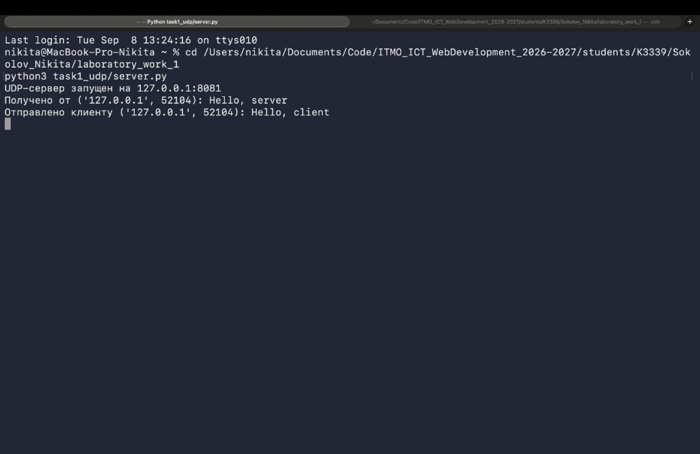
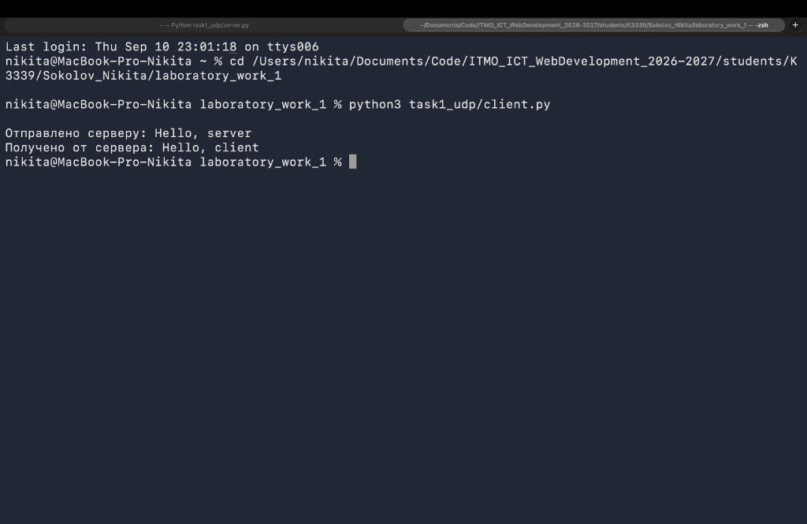

---

## 2. TCP: квадратное уравнение

**Протокол.** TCP (`SOCK_STREAM`): `listen` / `accept` / `connect`, надёжная доставка.

**Что сделано.** Клиент вводит `a`, `b`, `c`, сервер считает корни \(ax^2+bx+c=0\) и возвращает текст.  
Пример: `1 -3 2` → корни `2` и `1`.

??? info "Сервер — task2_tcp/server.py"
    ```python
    from __future__ import annotations

    import math
    import socket

    HOST = "127.0.0.1"
    PORT = 8082
    BUFFER_SIZE = 1024

    def solve_quadratic(a: float, b: float, c: float) -> str:
        if a == 0:
            if b == 0:
                if c == 0:
                    return "Бесконечно много решений (0 = 0)"
                return "Решений нет (противоречие)"
            x = -c / b
            return f"Линейное уравнение: x = {x}"

        discriminant = b * b - 4 * a * c
        if discriminant > 0:
            sqrt_d = math.sqrt(discriminant)
            x1 = (-b + sqrt_d) / (2 * a)
            x2 = (-b - sqrt_d) / (2 * a)
            return f"Два корня: x1 = {x1}, x2 = {x2} (D = {discriminant})"
        if discriminant == 0:
            x = -b / (2 * a)
            return f"Один корень: x = {x} (D = 0)"
        return f"Действительных корней нет (D = {discriminant})"

    def handle_client(conn: socket.socket, address: tuple[str, int]) -> None:
        print(f"Подключился клиент {address}")
        with conn:
            data = conn.recv(BUFFER_SIZE)
            if not data:
                return
            raw = data.decode("utf-8").strip()
            print(f"Получено от {address}: {raw}")
            try:
                parts = raw.replace(",", " ").split()
                if len(parts) != 3:
                    raise ValueError("нужно ровно 3 числа: a b c")
                a, b, c = map(float, parts)
                result = solve_quadratic(a, b, c)
            except ValueError as exc:
                result = f"Ошибка ввода: {exc}"
            conn.sendall(result.encode("utf-8"))
            print(f"Ответ клиенту {address}: {result}")

    def main() -> None:
        with socket.socket(socket.AF_INET, socket.SOCK_STREAM) as server:
            server.setsockopt(socket.SOL_SOCKET, socket.SO_REUSEADDR, 1)
            server.bind((HOST, PORT))
            server.listen(5)
            print(f"TCP-сервер (квадратное уравнение) на {HOST}:{PORT}")
            while True:
                conn, address = server.accept()
                handle_client(conn, address)

    if __name__ == "__main__":
        main()
    ```

??? info "Клиент — task2_tcp/client.py"
    ```python
    import socket

    HOST = "127.0.0.1"
    PORT = 8082
    BUFFER_SIZE = 1024

    def main() -> None:
        print("Решение квадратного уравнения ax² + bx + c = 0")
        a = input("Введите a: ").strip()
        b = input("Введите b: ").strip()
        c = input("Введите c: ").strip()
        payload = f"{a} {b} {c}"

        with socket.socket(socket.AF_INET, socket.SOCK_STREAM) as client:
            client.connect((HOST, PORT))
            client.sendall(payload.encode("utf-8"))
            response = client.recv(BUFFER_SIZE).decode("utf-8")
            print(f"Ответ сервера: {response}")

    if __name__ == "__main__":
        main()
    ```

```bash
python3 task2_tcp/server.py
python3 task2_tcp/client.py
```

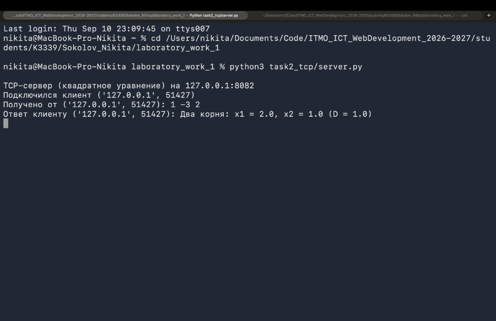
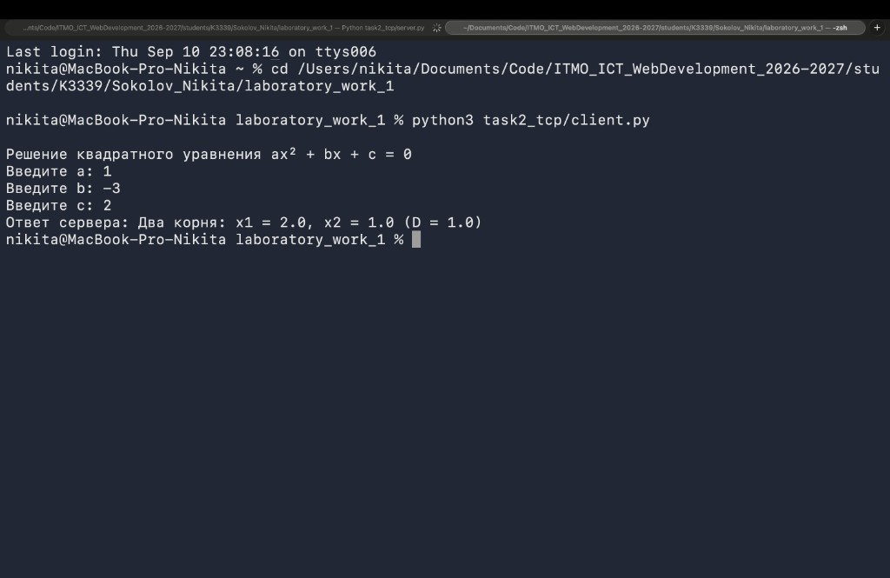

---

## 3. HTTP: отдача HTML

**Протокол.** Ответ вручную: статус, заголовки (`Content-Type`, `Content-Length`), пустая строка, тело.

**Что сделано.** Сервер читает `index.html` и отдаёт его по TCP. Клиент — браузер.

??? info "Сервер — task3_http/server.py"
    ```python
    from pathlib import Path
    import socket

    HOST = "127.0.0.1"
    PORT = 8083
    BUFFER_SIZE = 4096
    INDEX_PATH = Path(__file__).with_name("index.html")

    def build_response(body: bytes) -> bytes:
        headers = (
            "HTTP/1.1 200 OK\r\n"
            "Content-Type: text/html; charset=utf-8\r\n"
            f"Content-Length: {len(body)}\r\n"
            "Connection: close\r\n"
            "\r\n"
        )
        return headers.encode("utf-8") + body

    def main() -> None:
        html = INDEX_PATH.read_bytes()
        with socket.socket(socket.AF_INET, socket.SOCK_STREAM) as server:
            server.setsockopt(socket.SOL_SOCKET, socket.SO_REUSEADDR, 1)
            server.bind((HOST, PORT))
            server.listen(5)
            print(f"HTTP-сервер: http://{HOST}:{PORT}/")
            while True:
                conn, address = server.accept()
                with conn:
                    request = conn.recv(BUFFER_SIZE)
                    print(f"Запрос от {address}:\n{request.decode('utf-8', errors='replace')}")
                    conn.sendall(build_response(html))

    if __name__ == "__main__":
        main()
    ```

```bash
python3 task3_http/server.py
# http://127.0.0.1:8083/
```

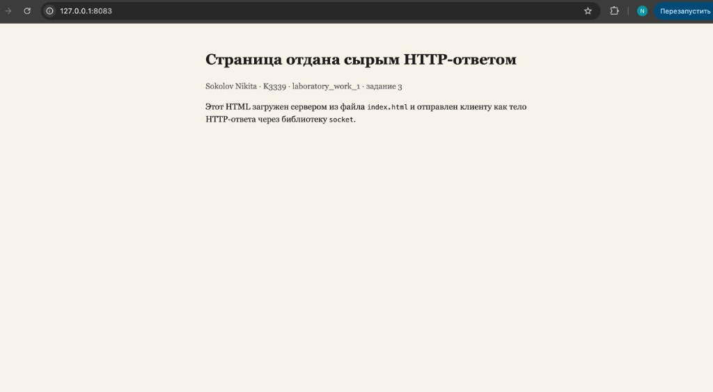
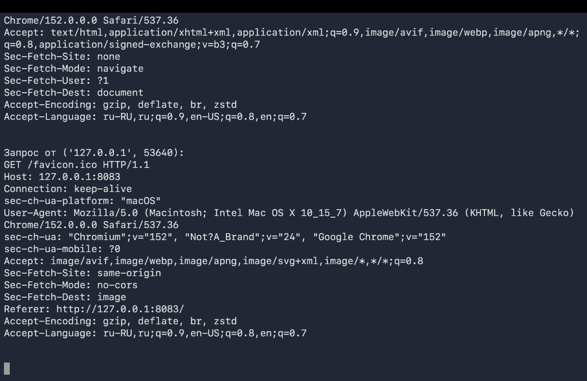

---

## 4. Многопользовательский чат

**Протокол.** TCP + поток на каждого клиента. Один `client.py`, несколько запусков.

**Что сделано.** Ник при входе, сообщения всем кроме отправителя, выход `/exit`, словарь клиентов под `Lock`.

??? info "Сервер — task4_chat/server.py"
    ```python
    from __future__ import annotations

    import socket
    import threading

    HOST = "127.0.0.1"
    PORT = 8084
    BUFFER_SIZE = 1024

    clients: dict[socket.socket, str] = {}
    clients_lock = threading.Lock()

    def broadcast(message: str, sender: socket.socket | None = None) -> None:
        payload = message.encode("utf-8")
        with clients_lock:
            dead: list[socket.socket] = []
            for conn in clients:
                if conn is sender:
                    continue
                try:
                    conn.sendall(payload)
                except OSError:
                    dead.append(conn)
            for conn in dead:
                clients.pop(conn, None)
                try:
                    conn.close()
                except OSError:
                    pass

    def handle_client(conn: socket.socket, address: tuple[str, int]) -> None:
        nickname = f"user_{address[1]}"
        with clients_lock:
            clients[conn] = nickname
        try:
            conn.sendall(
                (
                    "Добро пожаловать в чат.\n"
                    "Сначала отправьте никнейм одной строкой.\n"
                    "Команда /exit — выход.\n"
                ).encode("utf-8")
            )
            raw_nick = conn.recv(BUFFER_SIZE)
            if not raw_nick:
                return
            nickname = raw_nick.decode("utf-8").strip() or nickname
            with clients_lock:
                clients[conn] = nickname
            join_msg = f"[сервер] {nickname} вошёл в чат"
            print(join_msg)
            broadcast(join_msg + "\n", sender=conn)
            conn.sendall(f"Вы вошли как {nickname}\n".encode("utf-8"))
            while True:
                data = conn.recv(BUFFER_SIZE)
                if not data:
                    break
                text = data.decode("utf-8").strip()
                if not text:
                    continue
                if text == "/exit":
                    conn.sendall("Вы вышли из чата.\n".encode("utf-8"))
                    break
                message = f"{nickname}: {text}\n"
                print(message.strip())
                broadcast(message, sender=conn)
        except OSError:
            pass
        finally:
            with clients_lock:
                left_name = clients.pop(conn, nickname)
            leave_msg = f"[сервер] {left_name} покинул чат"
            print(leave_msg)
            broadcast(leave_msg + "\n")
            try:
                conn.close()
            except OSError:
                pass

    def main() -> None:
        with socket.socket(socket.AF_INET, socket.SOCK_STREAM) as server:
            server.setsockopt(socket.SOL_SOCKET, socket.SO_REUSEADDR, 1)
            server.bind((HOST, PORT))
            server.listen(10)
            print(f"Чат-сервер на {HOST}:{PORT}")
            while True:
                conn, address = server.accept()
                thread = threading.Thread(
                    target=handle_client,
                    args=(conn, address),
                    daemon=True,
                )
                thread.start()

    if __name__ == "__main__":
        main()
    ```

??? info "Клиент — task4_chat/client.py"
    ```python
    import socket
    import threading

    HOST = "127.0.0.1"
    PORT = 8084
    BUFFER_SIZE = 1024

    def receive_messages(sock: socket.socket, stop_event: threading.Event) -> None:
        while not stop_event.is_set():
            try:
                data = sock.recv(BUFFER_SIZE)
            except OSError:
                break
            if not data:
                print("\nСоединение закрыто сервером.")
                stop_event.set()
                break
            print(data.decode("utf-8"), end="")

    def main() -> None:
        with socket.socket(socket.AF_INET, socket.SOCK_STREAM) as client:
            client.connect((HOST, PORT))
            stop_event = threading.Event()
            receiver = threading.Thread(
                target=receive_messages,
                args=(client, stop_event),
                daemon=True,
            )
            receiver.start()
            try:
                while not stop_event.is_set():
                    line = input()
                    if stop_event.is_set():
                        break
                    client.sendall((line + "\n").encode("utf-8"))
                    if line.strip() == "/exit":
                        break
            except (EOFError, KeyboardInterrupt):
                try:
                    client.sendall(b"/exit\n")
                except OSError:
                    pass
            finally:
                stop_event.set()

    if __name__ == "__main__":
        main()
    ```

```bash
python3 task4_chat/server.py
python3 task4_chat/client.py   # в двух терминалах
```

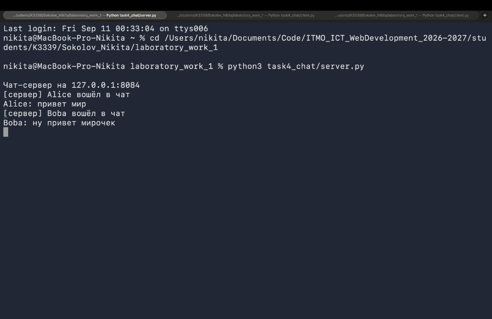
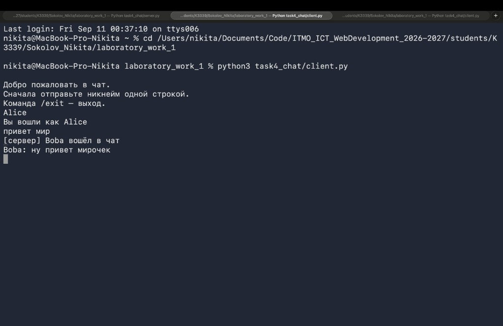
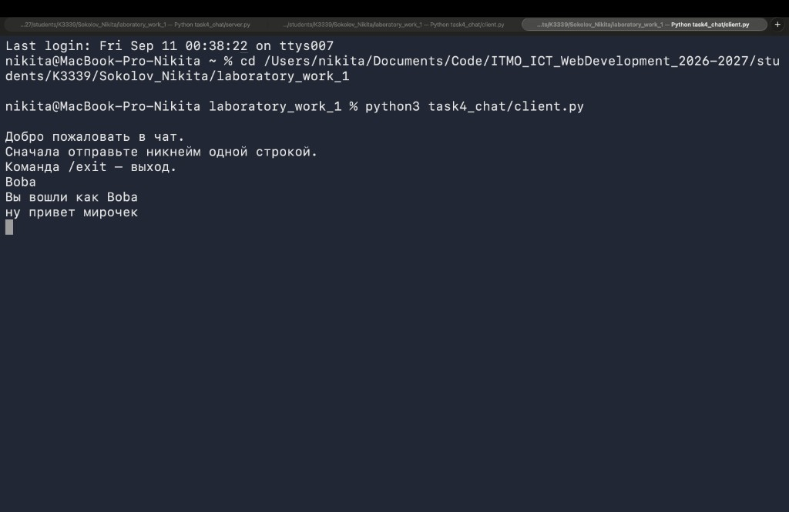

---

## 5. Журнал оценок

**Протокол.** Разбор HTTP GET/POST на сокетах (метод, путь, тело POST).

**Что сделано.** POST сохраняет дисциплину и оценку; ответ — HTML-таблица. Хранение `предмет → [оценки]`.

??? info "Сервер — task5_grades/server.py"
    ```python
    from __future__ import annotations

    from collections import defaultdict
    from urllib.parse import parse_qs
    import socket

    HOST = "127.0.0.1"
    PORT = 8085
    BUFFER_SIZE = 8192

    grades: dict[str, list[str]] = defaultdict(list)

    def read_http_request(conn: socket.socket):
        chunks: list[bytes] = []
        while b"\r\n\r\n" not in b"".join(chunks):
            piece = conn.recv(BUFFER_SIZE)
            if not piece:
                break
            chunks.append(piece)
        raw = b"".join(chunks)
        header_part, _, body = raw.partition(b"\r\n\r\n")
        lines = header_part.decode("utf-8", errors="replace").split("\r\n")
        method, path, *_ = (lines[0] if lines else "GET / HTTP/1.1").split(" ")
        headers = {}
        for line in lines[1:]:
            if ":" in line:
                key, value = line.split(":", 1)
                headers[key.strip().lower()] = value.strip()
        content_length = int(headers.get("content-length", "0") or "0")
        while len(body) < content_length:
            body += conn.recv(BUFFER_SIZE)
        return method.upper(), path, headers, body[:content_length]

    def handle_request(method: str, body: bytes) -> bytes:
        if method == "POST":
            form = parse_qs(body.decode("utf-8", errors="replace"))
            subject = (form.get("subject") or [""])[0].strip()
            grade = (form.get("grade") or [""])[0].strip()
            if subject and grade:
                grades[subject].append(grade)
                page = render_grades_page(f"Добавлено: {subject} → {grade}")
            else:
                page = render_grades_page("Нужно указать дисциплину и оценку")
            return http_response("200 OK", page)
        if method == "GET":
            return http_response("200 OK", render_grades_page())
        return http_response("405 Method Not Allowed", "<h1>405 Method Not Allowed</h1>")

    def main() -> None:
        with socket.socket(socket.AF_INET, socket.SOCK_STREAM) as server:
            server.setsockopt(socket.SOL_SOCKET, socket.SO_REUSEADDR, 1)
            server.bind((HOST, PORT))
            server.listen(5)
            print(f"Журнал оценок: http://{HOST}:{PORT}/")
            while True:
                conn, address = server.accept()
                with conn:
                    method, path, _headers, body = read_http_request(conn)
                    print(f"{address}: {method} {path}")
                    conn.sendall(handle_request(method, body))

    if __name__ == "__main__":
        main()
    ```

Функции `render_grades_page` / `http_response` — в том же файле (сборка HTML и HTTP-заголовков).

```bash
python3 task5_grades/server.py
# http://127.0.0.1:8085/
```

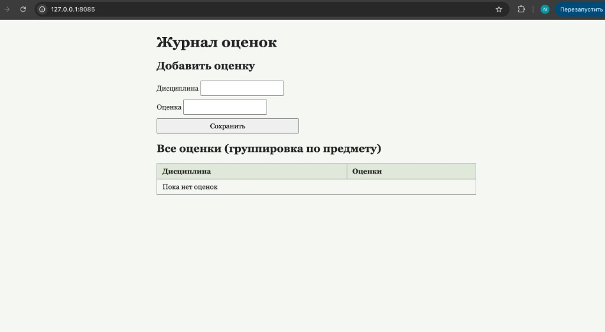
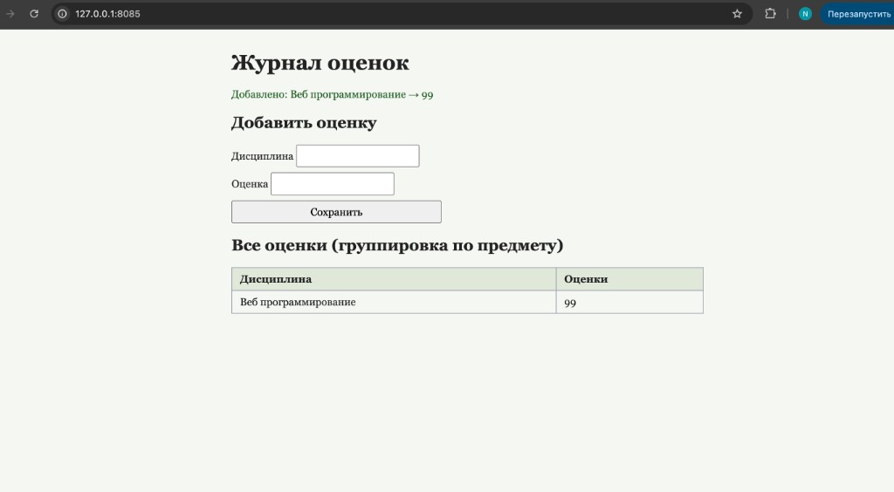
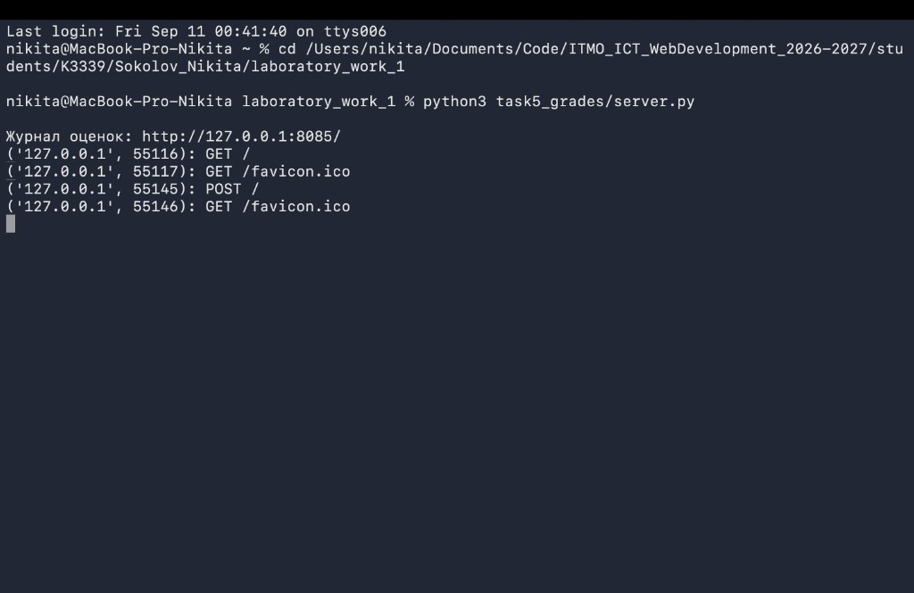
