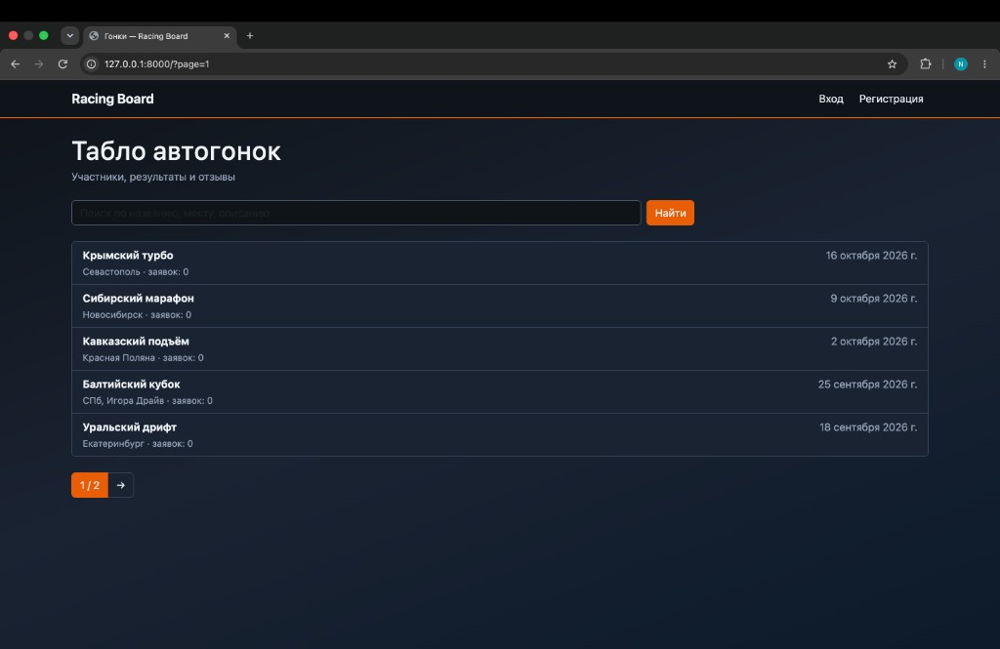
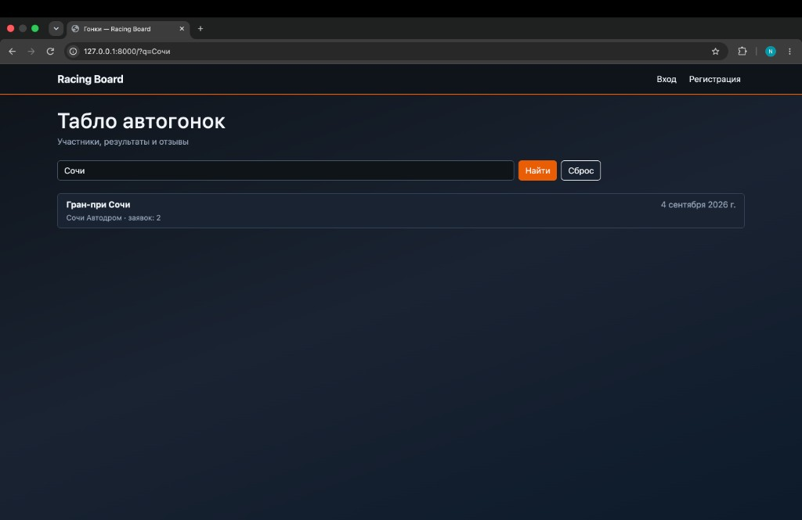
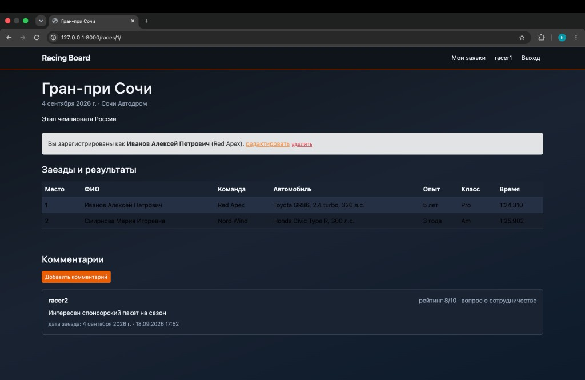
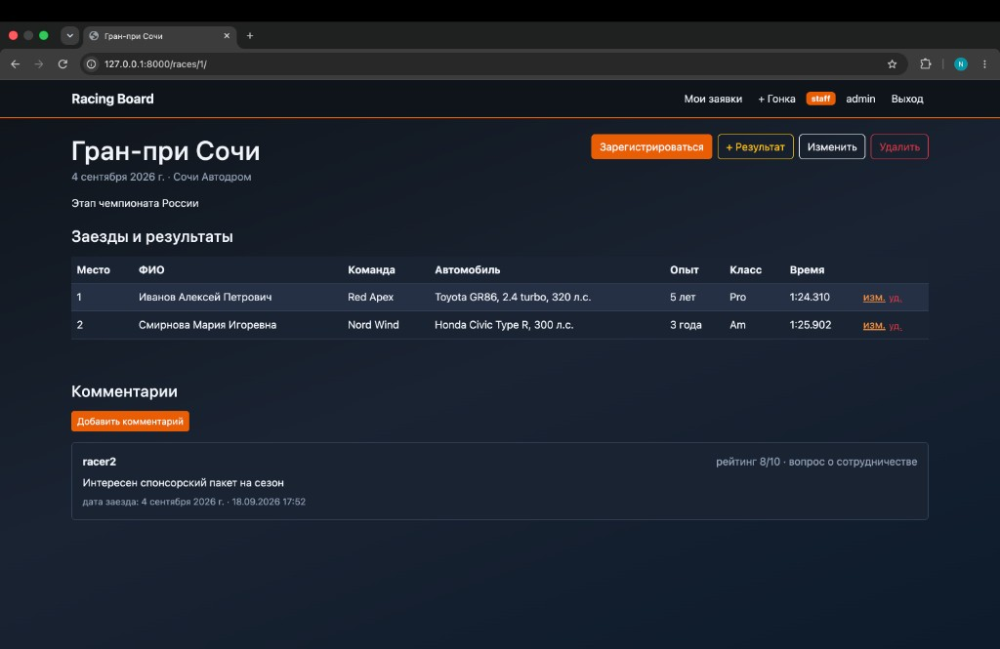
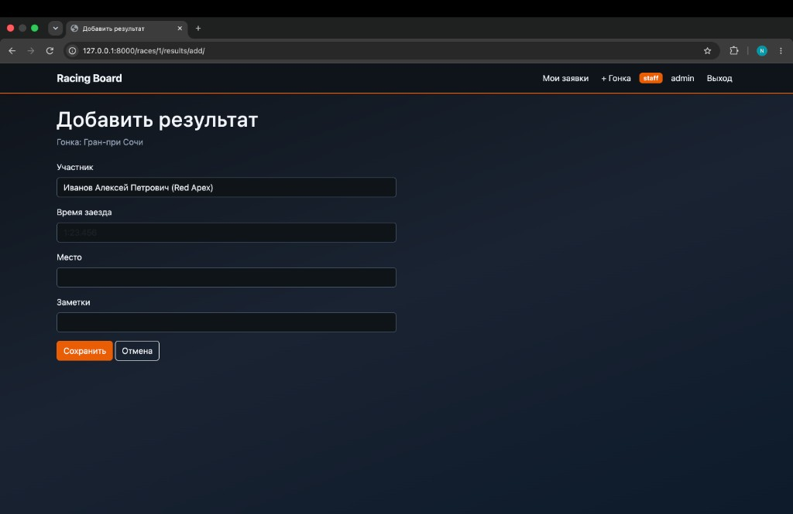
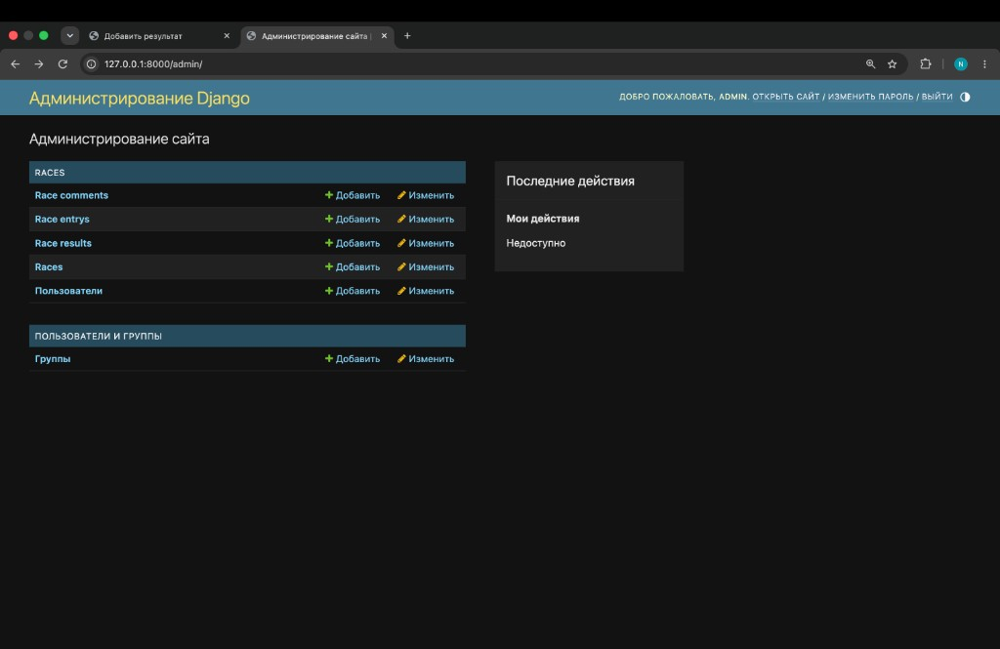

# ЛР2. Простой сайт на Django

Код: `students/K3339/Sokolov_Nikita/laboratory_work_2/`  
Вариант 6 — табло победителей автогонок.

| | |
|--|--|
| Стек | Django 4.2, Bootstrap 5, PostgreSQL |
| Приложение | `races` |
| Модели | `User`, `Race`, `RaceEntry`, `RaceResult`, `RaceComment` |

---

## Модель данных

- **User** — кастомный пользователь (`AbstractUser`), `AUTH_USER_MODEL`
- **Race** — гонка (название, описание, место, дата)
- **RaceEntry** — заявка участника (ФИО, команда, авто, описание, опыт, класс)
- **RaceResult** — результат заезда (время, место)
- **RaceComment** — отзыв (дата заезда, текст, тип, рейтинг 1–10, автор)

---

## Интерфейсы

| URL | Кто | Что |
|-----|-----|-----|
| `/` | все | список гонок, поиск, пагинация |
| `/register/`, `/login/`, `/logout/` | гости / пользователи | вход и регистрация |
| `/races/<id>/` | все | детали, таблица заездов и результатов, комментарии |
| `/races/<id>/enter/` | пользователь | регистрация на гонку |
| `/entries/<id>/edit\|delete/` | владелец / администратор | правка своей заявки |
| `/races/<id>/comment/` | пользователь | комментарий |
| `/my-entries/` | пользователь | свои заявки |
| `/races/create/`, edit, delete | **администратор** | CRUD гонок в клиенте |
| `/races/<id>/results/add/`, edit, delete | **администратор** | время и место результата |
| `/admin/` | администратор | панель Django |

Разграничение прав на клиенте: ``, то есть кнопки создания гонок и результатов видны только администратору.

### Список гонок

Главная страница: список, поиск, пагинация.



### Поиск

Фильтрация списка по названию, месту, описанию.



### Страница гонки (пользователь)

Таблица заездов и результатов, своя заявка, комментарии. Без кнопок администратора.



### Страница гонки (администратор)

В клиенте видны метки «админ», «+ Результат», «Изменить», «Удалить», правка результатов в таблице.



### Добавление результата (администратор)

Время заезда и место в клиентском интерфейсе.



### Панель администратора Django

Время заезда и результаты также задаются через `/admin/`.



---

## Запуск

```bash
cd students/K3339/Sokolov_Nikita/laboratory_work_2
python3 -m venv .venv && source .venv/bin/activate
pip install -r requirements.txt
python manage.py migrate
python manage.py seed_data
python manage.py runserver
```

| Логин | Пароль |
|-------|--------|
| `admin` | `admin123` |
| `racer1` | `racer123` |
