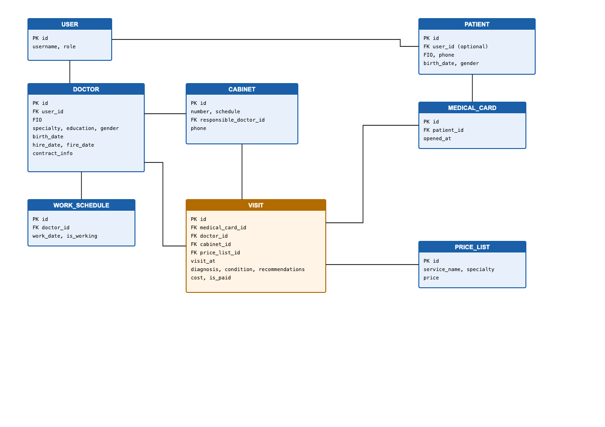
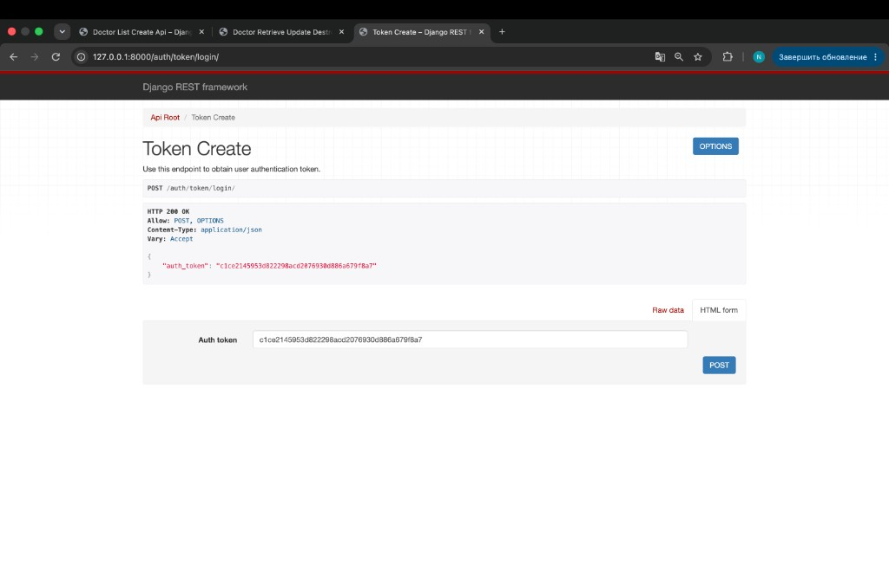
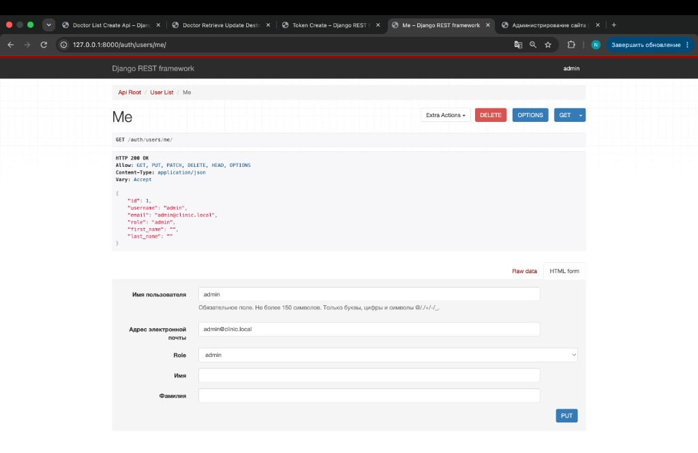
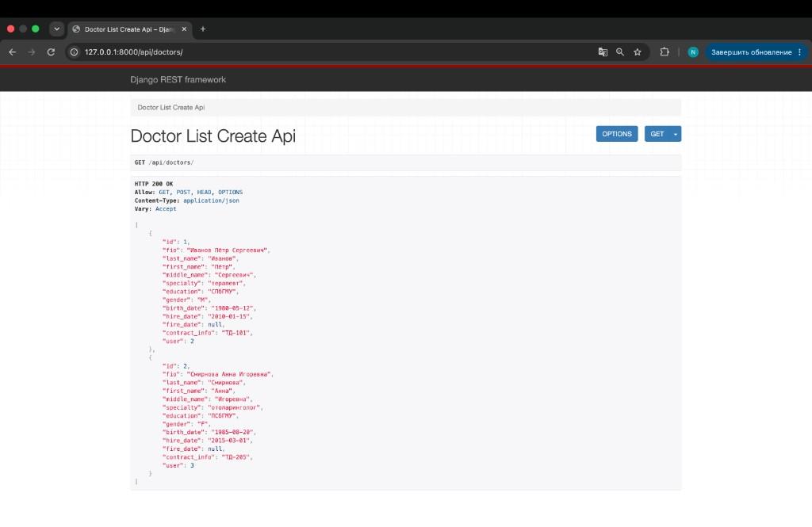
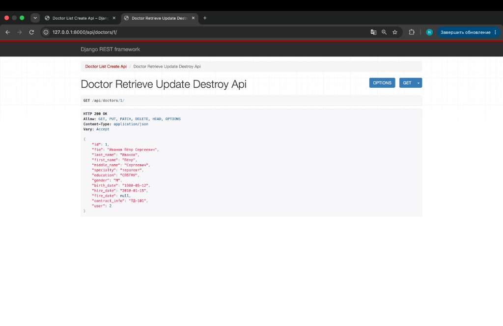
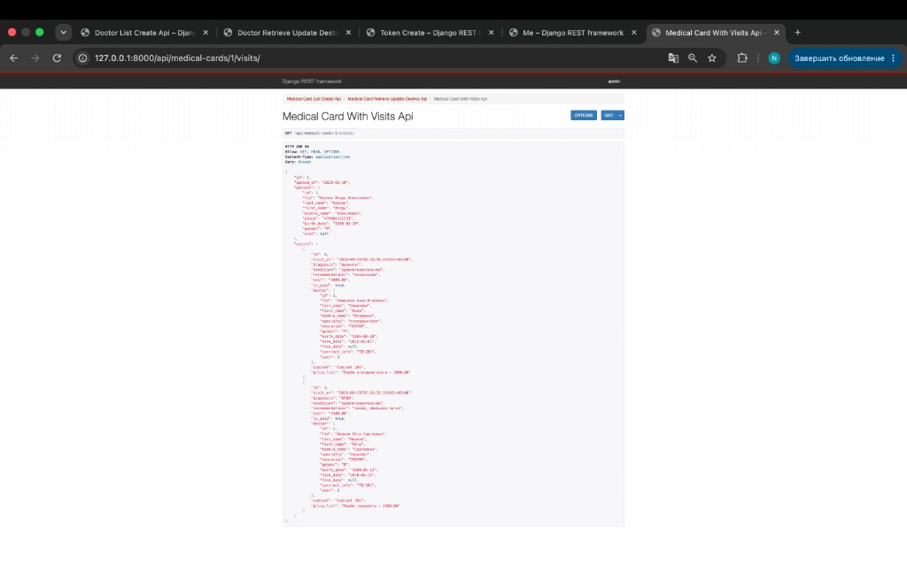
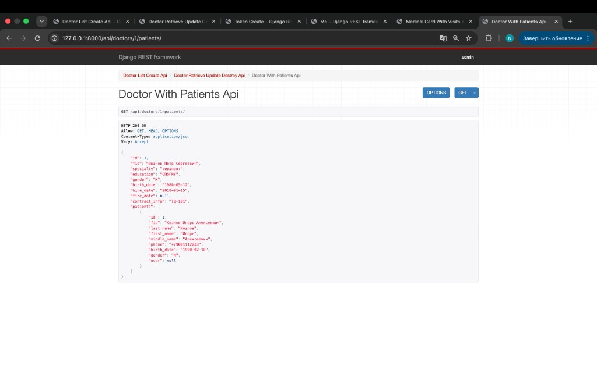
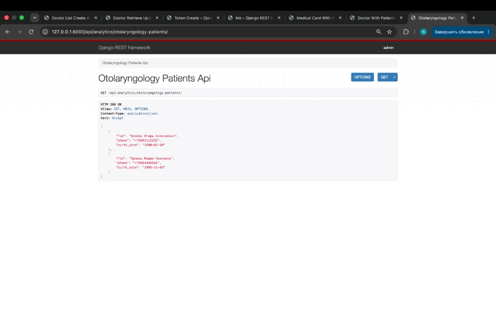
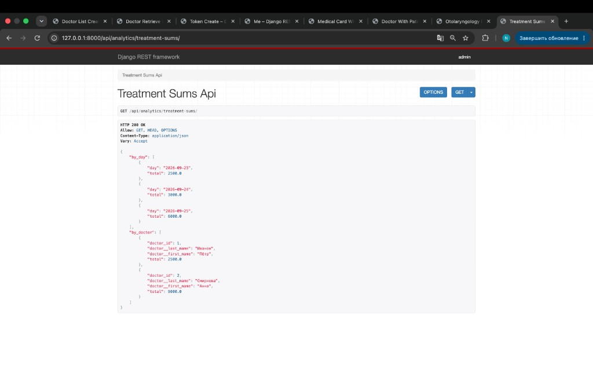

# ЛР3. Django REST Framework

Код: `students/K3339/Sokolov_Nikita/laboratory_work_3/`  
Вариант 10 — лечебная клиника.

| | |
|--|--|
| Стек | Django 4.2, DRF, Djoser, PostgreSQL |
| Приложение | `clinic` |
| Модели | `User`, `Doctor`, `Patient`, `MedicalCard`, `Cabinet`, `PriceList`, `WorkSchedule`, `Visit` |

---

## Модель данных

- **User** — роли admin / doctor / patient (`AUTH_USER_MODEL`)
- **Doctor** — ФИО, специальность, образование, пол, ДР, даты работы, договор
- **Patient** — ФИО, телефон, ДР, пол
- **MedicalCard** — 1:1 к пациенту
- **Cabinet** — номер, режим, ответственный врач, телефон
- **PriceList** — услуга, специальность, цена
- **WorkSchedule** — график врача (дата, рабочий/выходной)
- **Visit** — приём: карта, врач, кабинет, прейскурант, диагноз, состояние, рекомендации, стоимость, оплата

Связь Doctor N–M Patient реализуется через Visit.

---

## Auth (Djoser)

| Method | URL | Что |
|--------|-----|-----|
| POST | `/auth/users/` | регистрация |
| POST | `/auth/token/login/` | получить token |
| POST | `/auth/token/logout/` | выйти |
| GET | `/auth/users/me/` | текущий пользователь |

Заголовок: `Authorization: Token <auth_token>`

### Получение token

### Текущий пользователь

---

## CRUD API

| URL | Операции |
|-----|----------|
| `/api/doctors/` | list, create, retrieve, update, delete |
| `/api/patients/` | list, create, retrieve, update, delete |
| `/api/medical-cards/` | list, create, retrieve, update, delete |
| `/api/visits/` | list, create, retrieve, update, delete |
| `/api/cabinets/` | list, create, retrieve, update, delete |
| `/api/price-list/` | list, create, retrieve, update, delete |
| `/api/schedules/` | list, create, retrieve, update, delete |

### Список врачей

### Один врач

---

## Nested GET

| URL | Связь |
|-----|--------|
| `/api/medical-cards/<id>/visits/` | 1:N — карта и вложенные приёмы |
| `/api/doctors/<id>/patients/` | N:M через Visit — врач и пациенты |

### Карта с приёмами

### Врач с пациентами

---

## Аналитика (вариант 10)

| URL | Что |
|-----|-----|
| `/api/analytics/doctor/<id>/patients/` | пациенты врача по алфавиту + даты/стоимость |
| `/api/analytics/otolaryngology-patients/` | телефоны пациентов ЛОРов, год рождения > 1987 |
| `/api/analytics/doctors-by-date/?date=YYYY-MM-DD` | врачи с рабочим днём |
| `/api/analytics/visits-by-date/` | число приёмов по датам |
| `/api/analytics/treatment-sums/` | суммы по дням и по врачам |
| `/api/analytics/paid-patients/` | пациенты, оплатившие лечение |
| `/api/analytics/doctor-period-report/?from=&to=` | отчёт по врачам за период |

### Пациенты ЛОР

### Суммы лечения

---

## Запуск

См. `laboratory_work_3/README.md`. После `seed_clinic`: `admin` / пароль из `.env` (`DEMO_ADMIN_PASSWORD`).
