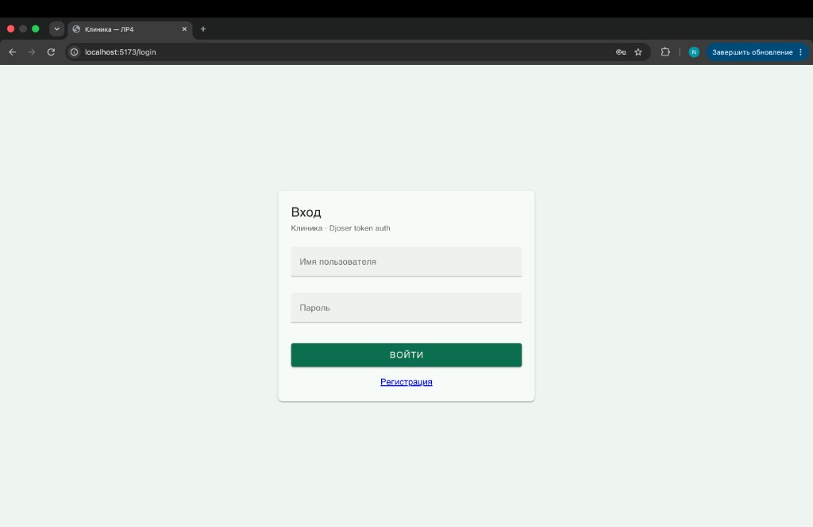
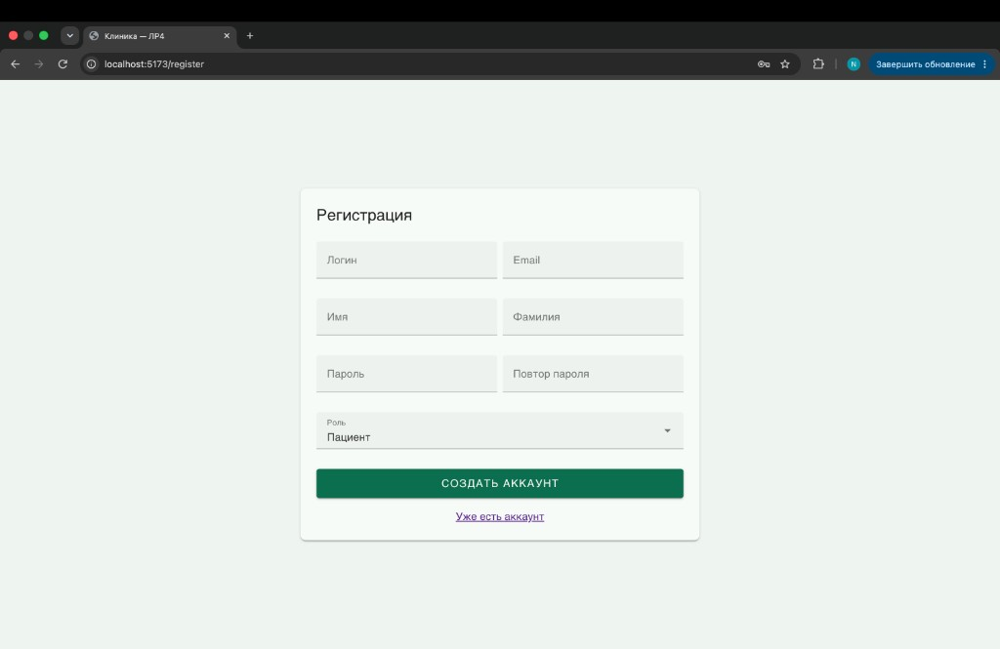
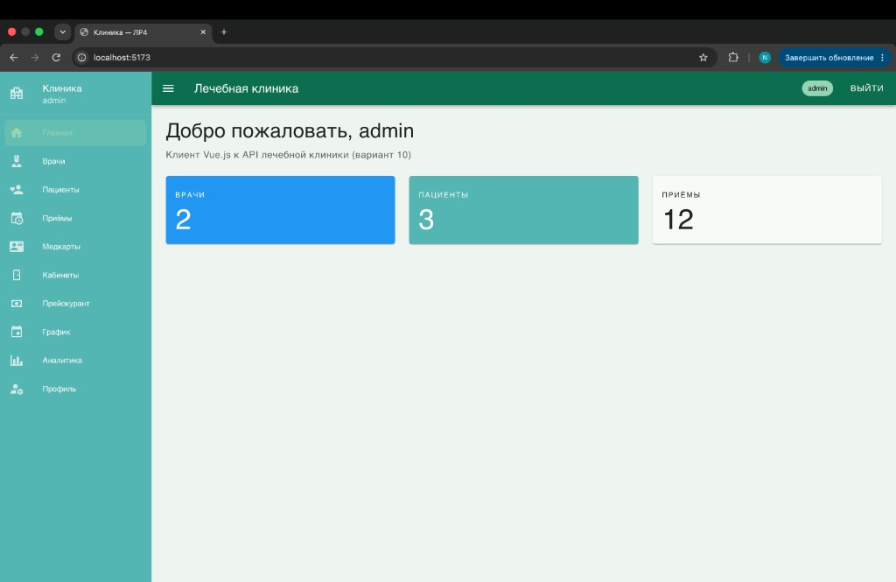
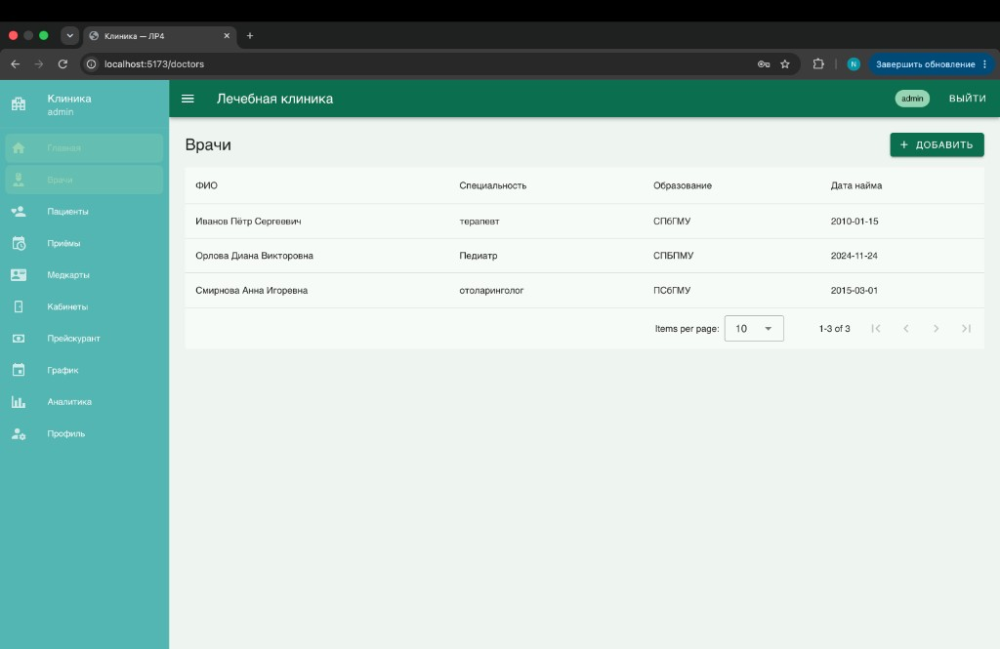
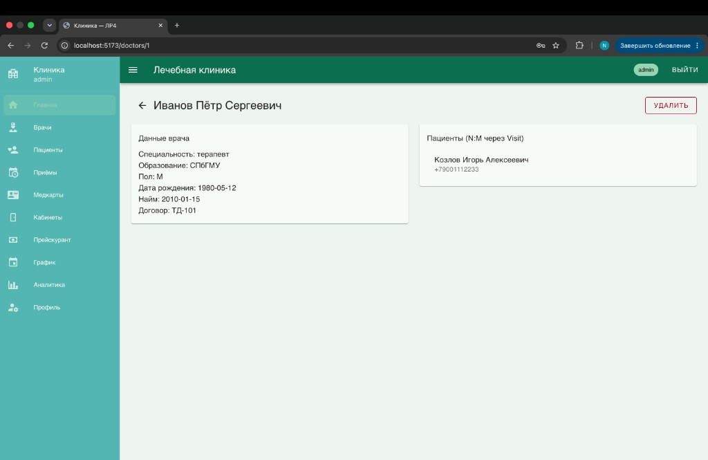
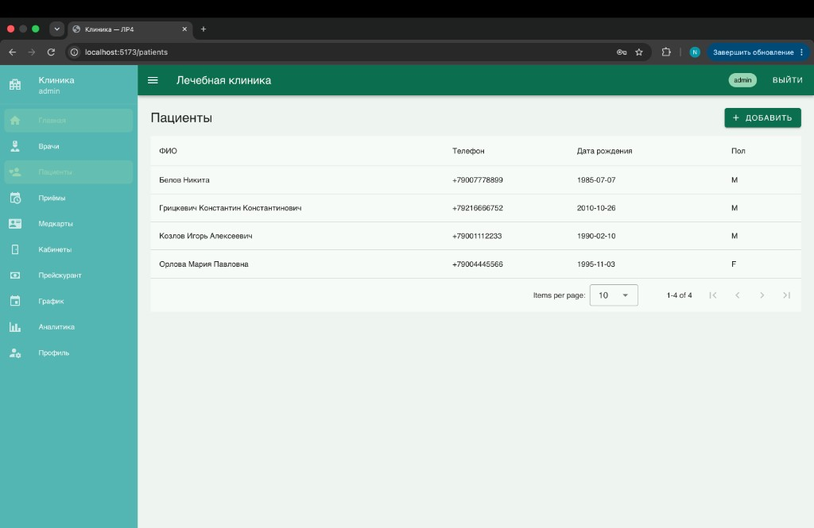
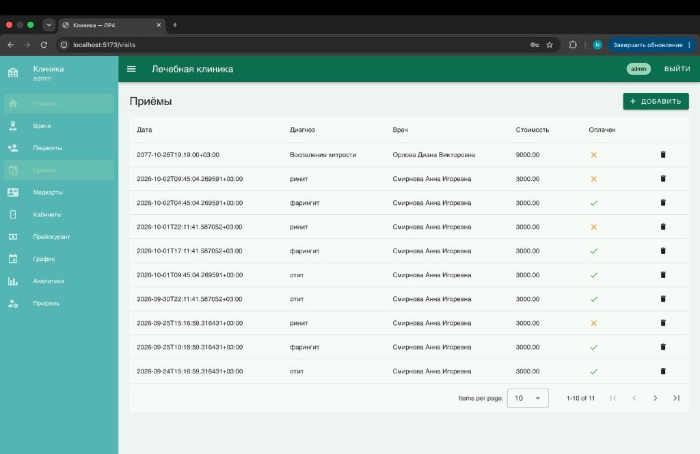
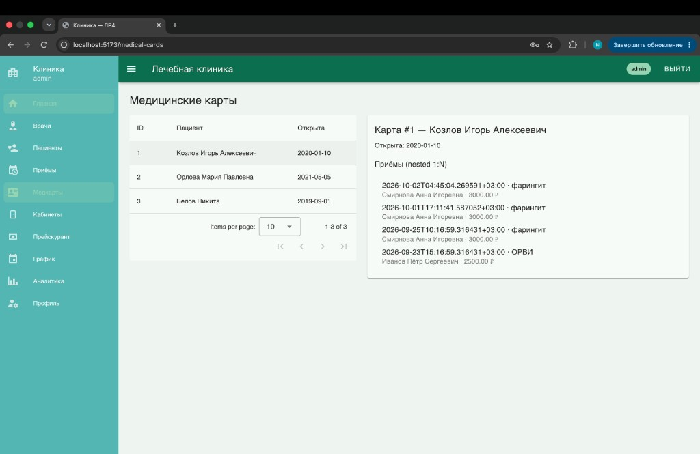
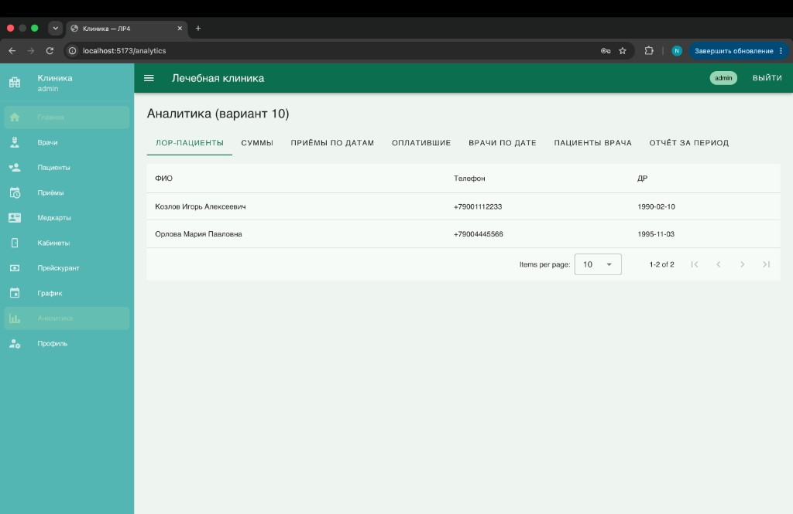
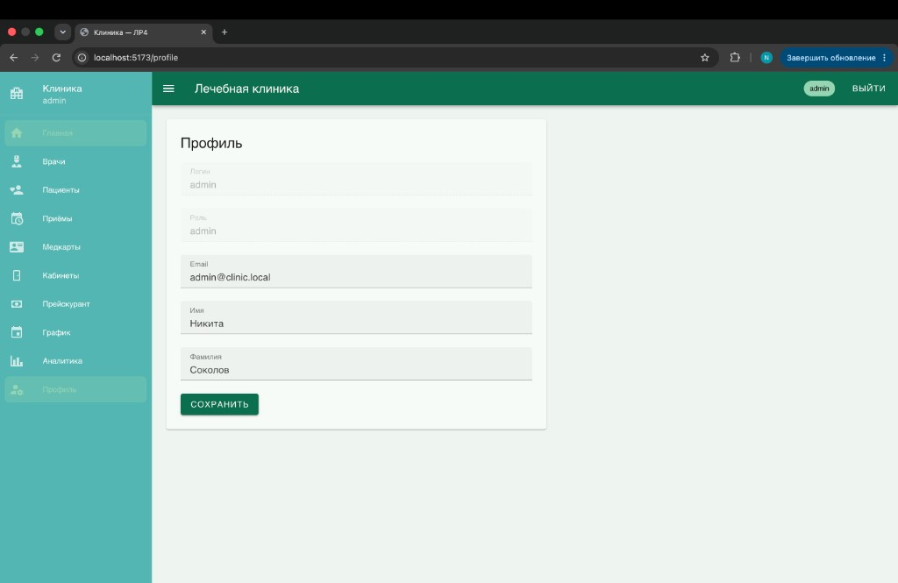

# ЛР4. Vue.js

Код: `students/K3339/Sokolov_Nikita/laboratory_work_4/`  
Вариант 10 — лечебная клиника (клиент к API ЛР3).

| | |
|--|--|
| Стек | Vue 3, Vite, Vuetify 3, Pinia, Vue Router, Axios |
| Бэкенд | Django REST + Djoser (`laboratory_work_3`) |
| CORS | `django-cors-headers`, origin `http://localhost:5173` |

---

## Интерфейсы

| URL | Назначение |
|-----|------------|
| `/login` | вход, token |
| `/register` | регистрация |
| `/profile` | изменение учётных данных |
| `/doctors`, `/doctors/:id` | врачи, nested пациенты |
| `/patients`, `/patients/:id` | пациенты |
| `/visits` | приёмы |
| `/medical-cards` | карты + nested приёмы |
| `/cabinets`, `/price-list`, `/schedules` | справочники |
| `/analytics` | аналитика варианта 10 |

### Вход

### Регистрация

### Главная

### Врачи

### Карточка врача

### Пациенты

### Приёмы

### Медкарты

### Аналитика

### Профиль

---

## Практики

| № | Папка | Что |
|---|-------|-----|
| 4.1 | `practical_works/js_basics/` | базовый JS |
| 4.2 | `practical_works/vue_project/` | Vue: Hello, роутинг, warriors |
| 4.3 | CORS в ЛР3 + `warriors_project` | `django-cors-headers` |

## Запуск

См. `laboratory_work_4/README.md`.
